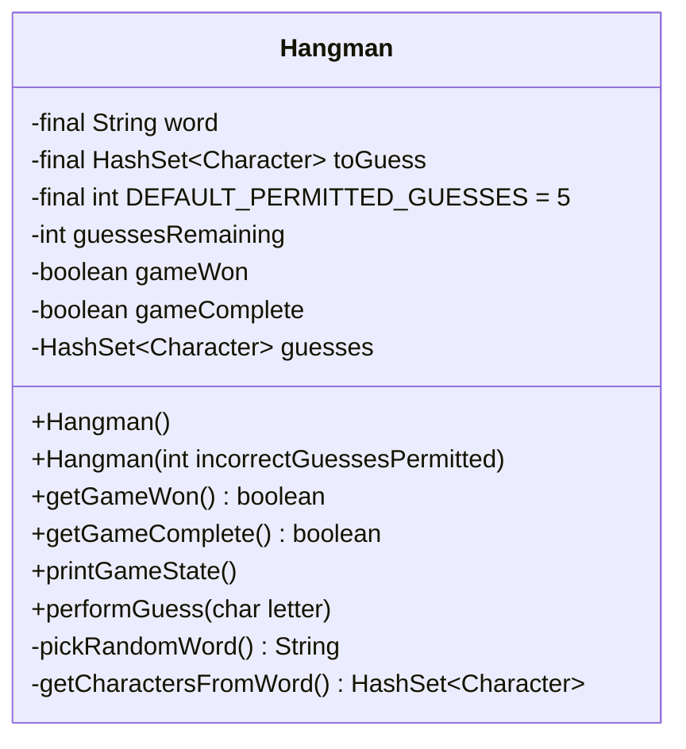

# Player's Guide Project

Teaching myself Java programming by following the steps in the [player's
guide](players_guide_java.md). Tasks are tagged with git according to their
day when completed. Opening the completed Day 23 task is as simple as:

```shell
git checkout day23
```

**Current task:** [Day 30](/players_guide_java.md#day-30-design-challenge-hangman-150-xp)

The UML class diagram for hangman is shown [below](#class-diagram). When the constructor is called without an
argument the empty constructor then calls the second constructor with `DEFAULT_PERMITTED_GUESSES` as argument where
guessesRemaining gets assigned to incorrectGuessesPermitted. Next, the `pickRandWord()` method (which selects a
random word in **lowercase**) is called whose return assigns `String word`. `HashSet<Character> toGuess` is assigned
next with the `getCharactersFromWord()` method which returns a list of the unique characters in the chosen word. The
`printGameState()` prints the current state of the game in the [format described in the player's
guide](/players_guide_java.md#day-30-design-challenge-hangman-150-xp). The `performGuess(char letter)` method first
checks if `boolean gameComplete` is false and if it is it then checks if `char letter` is a valid letter (not a
number, symbol, etc.) converts it to lowercase. If `char letter` is already in `HashSet<Character> guesses` the
function returns, else, it checks if `char letter` is in `HashSet<Character> toGuess`. If it isn't
`int guessesRemaining` gets decremented. `char letter` is then added to `HashSet<Character> guesses`, after which
the following checks occur:

- If `guessesRemaining` is less than 1 `gameComplete` is set to false.
- Else if `toGuess` is entirely contained in `guesses` then both `gameComplete` and `gameWon` are set to true.
- Else the function returns.

#### Class diagram


