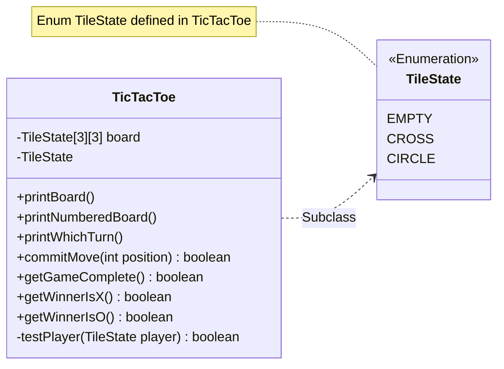

# Player's Guide Project

Teaching myself Java programming by following the steps in the [player's
guide](players_guide_java.md). Tasks are tagged with git according to their
day when completed. Opening the completed Day 23 task is as simple as:

```shell
git checkout day23
```

**Current task:** [Day 31](/players_guide_java.md#day-31-design-challenge-tic-tac-toe-300-xp)

In order to play multiple rounds of a game an extra while loop can be added to `PlayersGuide.main()`
enclosing the current program structure.

#### Class diagram


