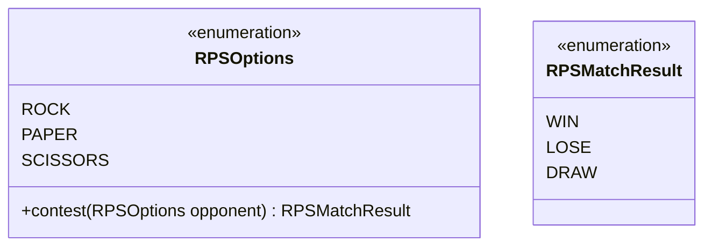
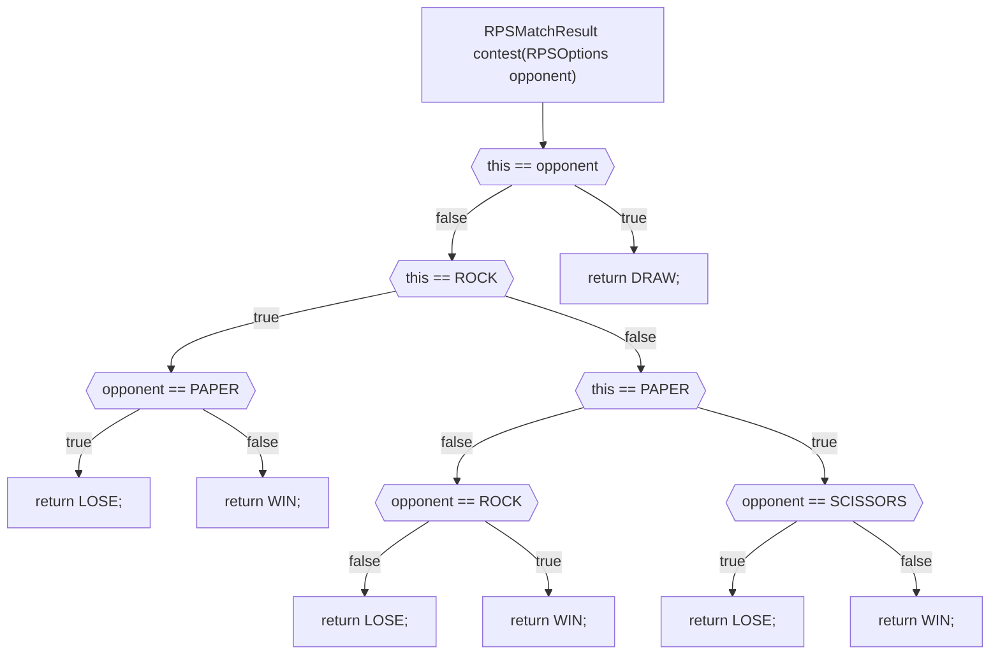
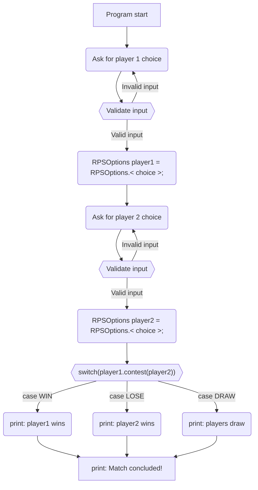
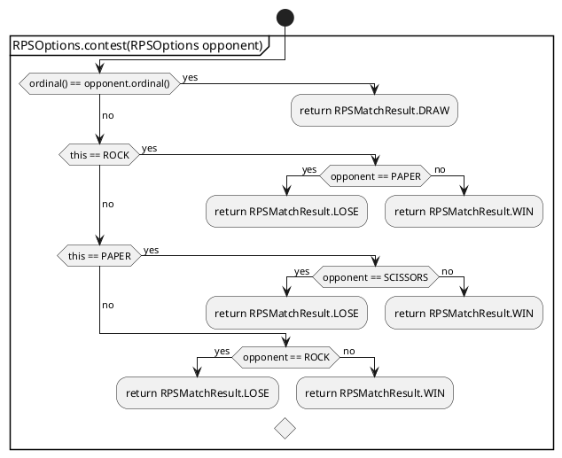

# Player's Guide Project

Teaching myself Java programming by following the steps in the [player's guide](players_guide_java.md). Tasks are
tagged with git according to their day when completed. Opening the completed Day 23 task is as simple as:

```shell
git checkout day23
```

**Current task:** [Day 28](/players_guide_java.md#day-28-design-challenge-rock-paper-scissors-150-xp)

#### Enums:



#### RPSOptions.contest() flow:



#### Main program flow:




