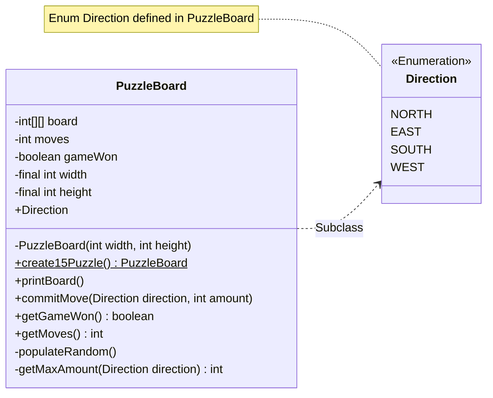

# Player's Guide Project

Teaching myself Java programming by following the steps in the [player's
guide](players_guide_java.md). Tasks are tagged with git according to their
day when completed. Opening the completed Day 23 task is as simple as:

```shell
git checkout day23
```

**Current task:** [Day 29](/players_guide_java.md#day-29-design-challenge-15-puzzle-150-xp)

The entire game with the necessary control logic can be implemented in a single class.
The UML diagram for this is shown [below](#class). A private constructor ensures that
the class can only be initialised using the static factory method
`PuzzleBoard.create15Puzzle()`. This method creates a 4 by 4 sized board and populates
it with the private `populateRandom()` method. The current state of the board is
printed to the terminal using `printBoard()`. The player manipulates the board with
the `commitMove(Direction direction, int amount)` method where `Direction direction`
is a nested Enum defined in PuzzleBoard and `int amount` the amount of tiles to move
towards the current empty spot on the board, everytime this function is called
`int moves` gets incremented. Bounds checking on `int amount` is done using the
private `getMaxAmount(Direction direction)` method which returns the maximum amount of
tiles that can be moved for that direction, this is to prevent an
ArrayIndexOutOfBoundsException from occurring. The amount of moves committed can be
requested using the simple `getMoves()` getter method. The private variable
`boolean gameWon` is used to track whether the game has been completed and is used to
prevent moves from being committed when the win state has been reached, this is
calculated at the end of the `commitMove()` method. `getGameWon()` is a simple getter.
Expanding the game to differently sized boards should then be as simple as defining a
new factory method.

#### Class:


